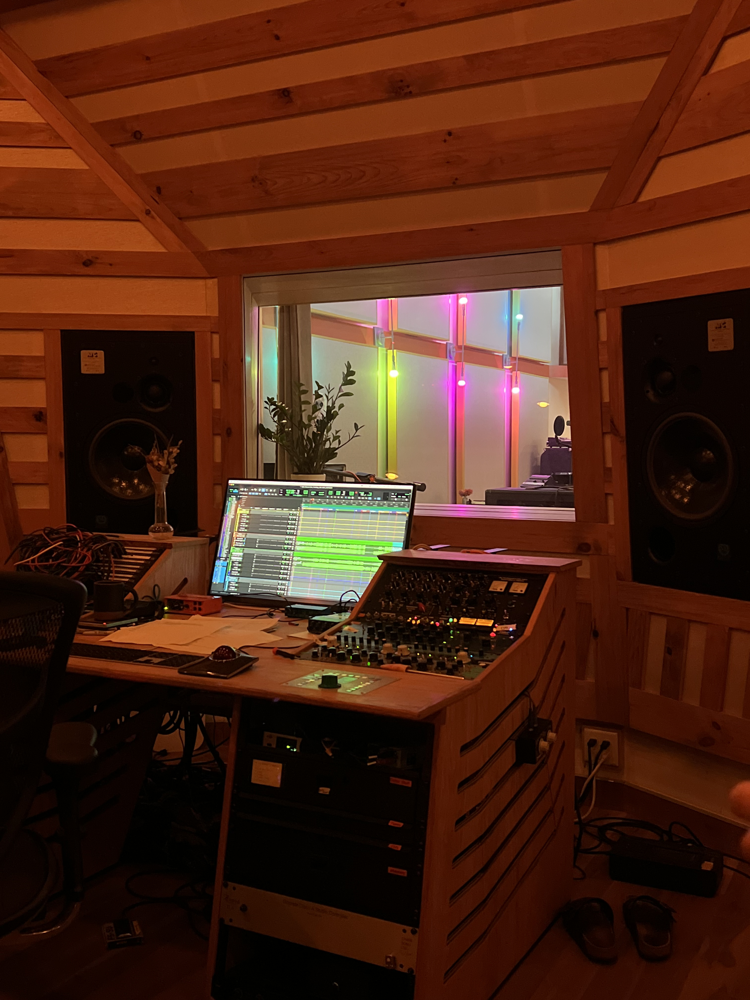

# Andres Lobo
[LinkedIn](https://www.linkedin.com/in/andres-lobo-7a402b23a/)

# Summary
I am a Geography graduate student at Appalachian State University in my second semester. I am based in Charlotte, North Carolina but I am willing to relocate. 
# Education
Appalachian State University | B.S. in Environmental Science, Conc. in Earth Systems May 2024
● GPA: 3.09/4.0
● Social Chair, Geological and Environmental Science Club
● Geological and Environmental Science Department Outreach
# Professional Experience
Barback - Olde Mecklenburg Brewery | Charlotte, NC May 2022 - Present
Assisted with opening and closing duties. Ensured the bar is well-stocked with ice, wine, cider, and beer. Checked taps and changed out kegs, if needed. Keeping the bar/tables clean by wiping down surfaces, sweeping and mopping, and emptying trash receptacles. Ran food and bussed tables.

Sales Associate - H&M | Charlotte, NC June 2021 - May 2022
Located merchandise for shoppers. Performed customer service and merchandising duties on the sales floor. Operated cash registers for customer purchases and/or returns.

Internship - Sound United, Polk Audio | Baltimore, MD June 2019 – July 2019
Assigned to submit a technical evaluation of a loudspeaker in terms of its electrical, transducer and system parameters. Implemented a crossover design via computer aided modeling, and performed subjective listening evaluations based on that modeling. Assisted engineers and technicians and sorted crossover parts and other technical components.

Volunteer – Self Organized Trash Pickups | Boone, NC January 2021 – April 2021
12 hours of trash pickup around Boone, NC for Civically Engaged Discourse class at Appalachian State University.

# Skills
qGIS | Microsoft Suite | R Studio | MATLAB | Adobe Suite
